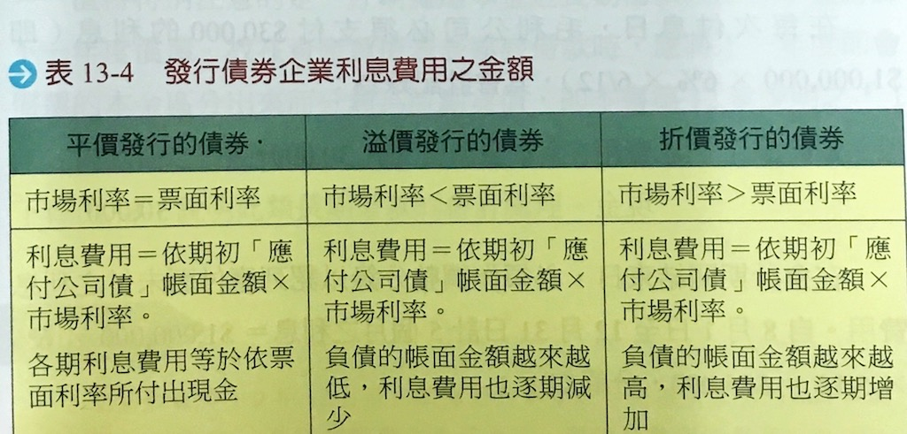
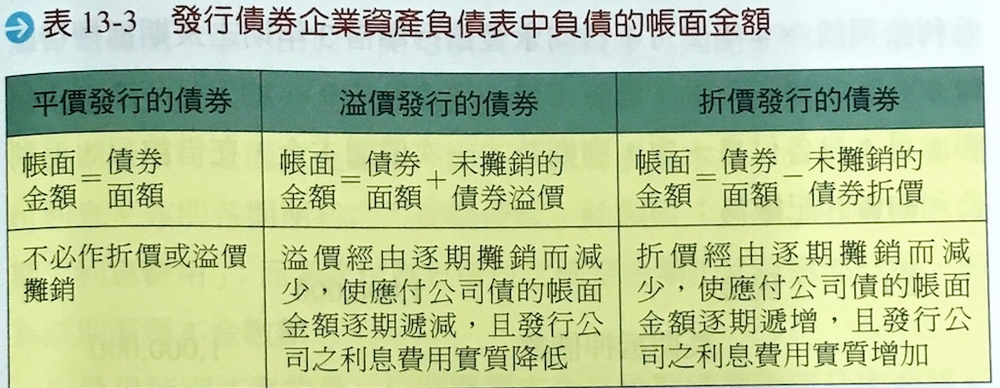

# 非流動負債


## 企業長期融資的理由

* 內部融資
  * 企業藉由減少分配現金股利，將盈餘保留下來不作分配，以挹注成長所需要的資金
* 外部融資
  * 企業以發行新股、發行公司債卷或是向銀行借款，以挹注成長所需資金

<br>

## 非流動負債的內容

### 意涵
* 凡非屬流動負債者之負債稱之

### 種類
* 長期銀行借款
  * 企業向銀行融資 1 年以後始需償還之借款。
  * 例如：如土地抵押借款、產品開發借款等
* 長期應付票據與款項
  * 企業開立到期期間超過 1 年的長期票據，其目的為向特定對象籌措資金
* 應付公司債
  * 係指企業籌措長期資金，經政府主管機關核准、所發行出售的債權憑證
* 應計退休金負債
  * 公司依勞基法需按月提撥勞工退休基金 => 沒有足額提撥者，就是退休金負債
* 融資租賃負債
  * 係指形式雖為租賃，實質類似分期付款買入資產的租賃交易，需認列租賃資產與負債
* 非流動之負債準備
  * ( 如 12 章 ）

## 非流動負債的衡量

### 貨幣時間價值
* 現值
  * 定義：將未來的現金流入或流出，依據市場利率折算到期初的價值
* 年金
  * 在相等間隔時間連續支付 ( 或收取 ) 相等金額的序列稱之
  * 區分
    * 普通年金：年底收付現金之年金
    * 期初年金：年初收付現金之年金
* 年金現值
  * 定義：將未來一系列的現金收付，依據市場利率折算到期初的價值

<br>

## 應付公司債之會計處理

* 種類
  * 普通公司債：投資人僅能於到期日，要求公司支付面額之公司債
  * 轉換公司債：投資人有權利於約定期間以一定價格將其轉換為股票的公司債
* 利率
  * 票面利率 ( r ) ：債券上記載需支付持有人現金利息之依據利率。
  * 市場利率 ( R ) ：市場投資人對特定類型的債券，所期望支付之利率。

### 平價發行公司債
* 意涵：當公司發行公司債時，票面利率等於市場利率 ( r=R ) 。
* 會計處理
  * 發行時：以面值 ─ `借` `(+)` `現金`、`貸` `(-)` `應付公司債`
  * 付息時：以市場利率計算 ─ `借` `(+)` `利息費用`、`貸` `(-)` `現金`
  * 年底時：以票面利率調整計算 ─ `借` `(+)` `利息費用`、`貸` `(-)` `應付利息` => 下期支付沖銷`應付利息`
  * 到期日：應先記錄利息費用，而後記錄償還公司債分錄。
* 特殊情況
  * 情況：非於債券發行日全數出售，部份在兩付息日間發行。
  * 作法：
    * 出售時：先向投資人預收`非屬`投資人應得之利息，並 `貸` `(-)` `應付利息`。
    * 第一次付息時：將上述的應付利息沖銷，降低第一期的`利息費用`。

### 折價發行公司債
* 意涵：當公司發行公司債時，票面利率低於市場利率 ( r < R ) 。
* 會計步驟：
  * `應付公司債折價`總額 = 債券面額 - 現金 ( 出售取得 )
  * 應付公司債帳面值 = 應付公司債 - 應付公司債折價
  * 利息費用 ( 每期 )：市場利率 × 應付公司債帳面值
  * 利息支出 ( 每期現金 ) ： 票面利率 × 應付公司債票面金額
  * 應付公司債折價攤銷金額 = 利息費用 - 利息支出 ( 現金 )
* 會計處理：
  * 發行時：`借` `(+)` `現金`及`應付公司債折價`、`貸` `(-)` `應付公司債`
  * 付息時：`借` `(+)` `利息費用`、`貸` `(-)` `現金`及`應付公司債折價`
  * 年底時：`借` `(+)` `利息費用`、`貸` `(-)` `應付利息`及`應付公司債折價` => 下期支付沖銷`應付利息`
  * 到期日：應先記錄利息費用，而後記錄償還公司債分錄

### 溢價發行公司債
* 意涵：當公司發行公司債時，票面利率高於市場利率 ( r > R )
* 會計步驟：
  * `應付公司債溢價`總額 = 現金 ( 出售取得 ) - 債券面額
  * 應付公司債帳面值 = 應付公司債 + 應付公司債溢價
  * 利息費用 ( 每期 )：市場利率 × 應付公司債帳面值
  * 利息支出 ( 每期現金 )：票面利率 × 應付公司債票面金額
  * 應付公司債溢價攤銷金額 = 利息支出 ( 現金 ) - 利息費用
* 會計處理：
  * 發行時：`借` `(+)` `現金`、`貸` `(-)` `應付公司債`及`應付公司債溢價`
  * 付息時：`借` `(+)` `利息費用`及`應付公司債溢價`、`貸` `(-)` `現金`
  * 年底時：`借` `(+)` `利息費用`及`應付公司債溢價`、`貸` `(-)` `應付利息`=> 下期支付沖銷`應付利息`
  * 到期日：應先記錄利息費用，而後記錄償還公司債分錄

### 可轉換公司債
* 定義：持有人有權在特定時間內，依約定的轉換價格或轉換比率，將公司債轉換成公司股票之債券稱之
* 處理：發行此類債券，視為出售`普通公司債`+`認股權`
* 會計處理
  * 計算：`認股權`成本 = 現金 ( 出售取得 ) - 普通公司債之公允價值
  * 出售時認列`認股權`：`借` `(+)` `現金`、`貸` `(-)` `資本公積─認股權`
  * 轉換時：`借` `(+)` `資本公積─認股權`及`公司債相關科目`、`貸` `(-)` `普通股股本`及`資本公積─普通股發行溢價`

### 課本表格 ( 原諒我懶得 KEY )



<br>



<br>

## 長期抵押借款應付票據
* 每期依浮動利率付息
  * 會計處理與平價發行公司債類似，將`應付公司債`科目改為`長期抵押借款`科目即可
* 每期支付固定金額
  * 應依市場利率計算`利息費用`，其與現金差額部份為`本金償還`
* 表達與揭露
  * 應將抵押資產的資訊於附註中揭露

<br>

## 長期信用風險指標
* 負債比率
  * 意涵：比率越高，代表財務結構差，企業還本付息壓力大，貸款申請比較不容易核准
  * 公式：

    ```
    總負債 / 總資產
    ```

* 利息保障倍數
  * 意涵：倍數越高，表示還款付息能力越強。
  * 公式：

    ```
    稅前息前淨利 / 年度利息費用 = ( 淨利 + 所得稅費用 + 利息費用 ) / 年度利息費用
    ```